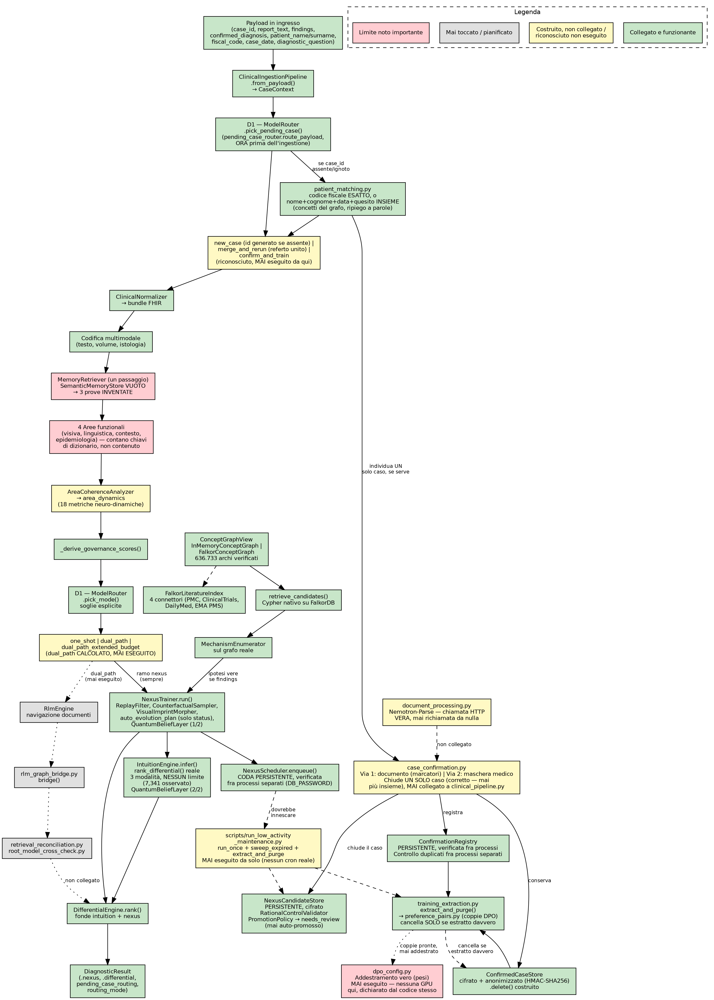

# Il percorso diagnostico completo — verificato, non presunto

**Scopo di questo documento.** Ogni affermazione qui è stata verificata
leggendo il codice o il documento citato per intero, non ricostruita a
memoria. Tre versioni dello stesso percorso — quello che esiste oggi,
quello previsto a maggio 2026, quello previsto dal documento di decisione
di settembre — messe fianco a fianco per trovare cosa è ridondante,
superato, o mai stato collegato.

**Seconda edizione.** La prima versione di questo documento fotografava
lo stato subito prima che D1, la persistenza, i due percorsi di conferma
e la letteratura in FalkorDB venissero costruiti. Questa edizione
aggiorna ogni sezione toccata da quel lavoro (PR #90-#100), mantenendo lo
stesso principio: cosa è verificato, cosa resta aperto, senza ambiguità
residua.

**Terza edizione.** Aggiunta la mappa concettuale grafica dello stato
attuale (sotto), aggiornata con il lavoro di abbinamento del paziente,
chiusura del caso, e estrazione condizionata (PR #102-#105). Ogni nodo è
colorato secondo il proprio stato reale verificato nel codice — verde
collegato e funzionante, giallo costruito ma non collegato, grigio mai
toccato, rosso limite noto importante.



---

## Parte 1 — Il percorso di oggi, verificato riga per riga

```
payload in ingresso
   │
   ▼
ClinicalInferencePipeline.run(payload)
   │
   ├─ ingestion.from_payload(payload)              → CaseContext
   │
   ├─ pick_pending_case()  [D1, primo passo — nuovo]
   │     └─ route_payload(payload, candidate_store)
   │           ├─ nessuna corrispondenza          → "new_case"
   │           ├─ case_id in sospeso, nuovi dati   → "merge_and_rerun"
   │           │     └─ report_text SOSTITUITO con la fusione
   │           │        (piu' recente in testa, riferimento al precedente)
   │           └─ case_id in sospeso, con diagnosi
   │              confermata nel payload            → "confirm_and_train"
   │                 └─ riconosciuto, allegato al risultato,
   │                    MAI eseguito da qui (vedi Parte 2bis)
   │
   ├─ normalizer.to_fhir_bundle(case)               → bundle FHIR
   ├─ codifica multimodale (testo, volume, istologia) → fused
   │
   ├─ _retrieve_and_rank()
   │     └─ MemoryRetriever.retrieve()  [recupero a UN passaggio]
   │           └─ SemanticMemoryStore — VUOTO, verificato, invariato
   │           └─ ricade sempre su _fallback_evidence()
   │                 3 prove INVENTATE, grounding_score fisso
   │     └─ EvidenceRanker → ranked_evidence
   │
   ├─ segnali delle 4 aree (visiva, linguistica, contesto, epidemiologia)
   │     └─ ognuna conta chiavi di dizionario, verificato, non contenuto
   │
   ├─ area_coherence.analyze() → area_dynamics
   │     └─ include neuro_dynamic_metrics (18 parametri, pesi a mano,
   │        "computational_abstraction_not_literal_neurobiology" —
   │        dichiarazione del codice stesso)
   │
   ├─ governance_scores = _derive_governance_scores(...)
   │
   ├─ pick_mode()  [D1, secondo passo — nuovo]
   │     └─ tabella di settembre applicata con soglie esplicite:
   │           mismatch_score ≥ 0,5      → dual_path_extended_budget
   │           risk ≥ 0,5 o reperti > 2  → dual_path
   │           risk ≤ 0,3 e reperti ≤ 2  → one_shot
   │           zona intermedia           → dual_path (default dichiarato)
   │     └─ routing_mode + routing_reason allegati al risultato finale
   │     └─ **il verdetto "dual_path" e' calcolato ma non eseguibile**:
   │        RlmEngine resta scollegato, quindi la pipeline prosegue
   │        comunque sul solo percorso a un passaggio sotto
   │
   ├─ nexus = _run_nexus_branch()  →  NexusTrainer.run()
   │     ├─ ReplayFilter.assess()
   │     ├─ CounterfactualSampler.sample()
   │     ├─ VisualImprintMorpher.nexus_morph()
   │     ├─ profilo di reiterazione (caso raro/limite/contraddizione)
   │     ├─ _alternative_hypotheses()
   │     │     SE payload["findings"] presente:
   │     │        MechanismEnumerator reale sul grafo → ipotesi vere
   │     │     ALTRIMENTI:
   │     │        etichette di ripiego (rare_case, adjacent_case, ...)
   │     ├─ _auto_evolution_plan()  [ridotto — aggiornato]
   │     │        ora calcola SOLO {"status": "candidate"/"hold_for_more_evidence"}
   │     │        letto dal vivo da safety/rails.py per la bandiera di
   │     │        verifica — candidate_score si e' spostato altrove (sotto)
   │     └─ belief_layer.update()  [QuantumBeliefLayer, chiamata 1/2]
   │
   ├─ nexus_scheduler.enqueue(case_context, area_dynamics, nexus, ...)
   │     └─ mette in coda — ORA PERSISTENTE quando DB_PASSWORD e' impostata
   │        (era puramente in memoria nella prima edizione di questo documento)
   │
   ├─ intuition_engine.infer(ranked_evidence, nexus, graph_candidates)
   │     ├─ rank_differential()  SE findings presenti → nomi VERI
   │     ├─ 3 modalità (rapida/razionale/contraddizione), somma di
   │     │        18 metriche con pesi fissi, NESSUN limite superiore
   │     │        (verificato: 7,341 osservato in un caso reale — invariato)
   │     └─ belief_layer.update()  [QuantumBeliefLayer, chiamata 2/2]
   │
   ├─ coordinator.run() → DifferentialEngine.rank(evidence, intuition, nexus)
   │     ├─ primaria = intuition, SE segnaposto → promossa da nexus reale
   │     └─ alternative = fuse da nexus.alternative_hypotheses
   │
   └─ _finalize_diagnostic_result() → DiagnosticResult (.nexus, .differential,
         pending_case_routing, routing_mode, routing_reason, ...)
         │
         ▼
   output in uscita
```

**Mai toccato da questo percorso, riverificato in questa edizione**:
- `rlm_engine.py` (navigazione ricorsiva dei documenti) — **invariato**
- `diagnostic_assembly.py` / `rlm_graph_bridge.py` — **invariato**
- `retrieval_reconciliation.py`, `root_model_cross_check.py` — **invariato**
- `training/case_confirmation.py` — **completato in questa edizione**:
  chiude un **solo** caso per chiamata (corretto — una prima versione
  chiudeva insieme tutti i casi in sospeso dello stesso paziente, sbagliato:
  due casi diversi per problemi diversi non vanno mai uniti), individua il
  caso tramite `case_id` o, quando assente, tramite `patient_matching.py`
  (codice fiscale esatto, o nome+cognome+data+quesito diagnostico insieme).
  Registra ogni chiusura in `ConfirmationRegistry` (nuovo, sotto). **Resta
  non chiamato** da `clinical_pipeline.py`/`app.py` — infrastruttura a sé,
  pensata per un ingresso separato (un documento di conferma, o una
  maschera per il medico)
- `training/patient_matching.py` — **nuovo**: abbinamento del paziente
  senza `case_id`, usato sia da `pending_case_router.py` (per
  `merge_and_rerun`) sia da `case_confirmation.py`. Un hash non si cerca
  per vicinanza (verificato); l'unico incorporamento testuale di questo
  progetto non è semantico (verificato) — usa invece corrispondenza per
  concetti del grafo, con un ripiego a sovrapposizione di parole quando
  il grafo (in inglese) non riconosce un quesito in italiano
- `governance/confirmation_registry.py` — **ora persistente** (era già
  presente, mai collegato a nulla prima). `case_confirmation.py` vi
  registra ogni chiusura; il controllo dei duplicati funziona anche fra
  processi separati
- `training/training_extraction.py` — **nuovo**: `extract_and_purge()`
  costruisce le coppie di addestramento DPO da `preference_pairs.py` (mai
  chiamato prima di questa edizione) e cancella da `ConfirmedCaseStore`
  **solo** i casi che hanno prodotto davvero una coppia utilizzabile — un
  caso senza alternative, o dove la diagnosi confermata non era mai stata
  proposta, resta conservato per revisione umana
- `document_processing.py` — **completato questa sessione (la vera
  chiamata HTTP a Nemotron-Parse), ma ancora mai richiamato da nulla**;
  nemmeno da `case_confirmation.py`, che si aspetta testo già estratto
  ma non lo richiede mai davvero da questo modulo
- `NexusScheduler.run_once()` — **ora ha un vero innesco**
  (`scripts/run_low_activity_maintenance.py`, ora esegue anche
  `sweep_expired_pending_cases()` e `extract_and_purge()` insieme), ma
  resta uno script esterno, mai eseguito automaticamente da questo
  progetto stesso — va pianificato dal deployment (cron, non GitHub
  Actions — vedi Parte 2bis)
- **L'addestramento vero, con cambiamento di pesi** (`dpo_config.py`) —
  **invariato, ancora teorico**: le coppie DPO si costruiscono
  correttamente, ma il ciclo di addestramento reale richiederebbe una GPU
  che questo ambiente non ha — dichiarato esplicitamente dal codice
  stesso, non presunto

---

## Parte 2 — Cosa prevedeva la documentazione di maggio

Fonti: `architecture_consistency_matrix.md`, `final_treatise_decision_record.md`,
`neuro_vector_evolution_strategy.md`, `dream_self_evolution_governance.md`.

```
NexusTrainer (Fase 1, per caso, sincrona)
   │
   ▼ il proprio output "nexus"
NexusScheduler (Fase 2, offline, bassa attività)
   │
   ├─ NexusSelfEvolutionLoop.generate_candidate()  [rinominato — rehearse() rimosso]
   │     └─ genera il testo del candidato, calcola candidate_score
   │        (spostato qui da _auto_evolution_plan() — vedi Parte 4)
   │
   ├─ RationalControlValidator.evaluate()
   │     └─ verifica soglie aggiuntive prima della promozione finale
   │
   └─ PromotionPolicy.decide()
         └─ 5 stati: candidate → needs_review → promoted/rejected/retired
         └─ **verificato con le impostazioni di default di questo
            progetto** (`allow_automatic_promotion=False`,
            `require_human_review_for_promoted=True`): non promuove
            MAI automaticamente — anche un candidato che supera ogni
            soglia interna finisce comunque in needs_review

Deposito vettoriale previsto: Weaviate/Qdrant — SUPERATO, FalkorDB scelto
e implementato (Parte 4)
Parser documentale previsto: Docling — SUPERATO, sostituito da
Nemotron-Parse (ora con la vera chiamata HTTP implementata)
Modello di ragionamento previsto: "Gemma 4" — ancora non confermato
```

**Cosa di questo è collegato, oggi, aggiornato**: l'intera catena
`NexusTrainer → NexusScheduler → NexusCandidateStore → RationalControlValidator
→ PromotionPolicy` è ora **realmente eseguibile e persistente**. Quello
che mancava — un innesco che la faccia girare da sola, e uno stato
condiviso fra il servizio live e quell'innesco — è stato costruito
(`scripts/run_low_activity_maintenance.py`, persistenza cifrata per
`NexusCandidateStore` e per la coda di `NexusScheduler`).

---

## Parte 2bis — La chiusura di un caso: conferma e conservazione (nuova sezione)

Non prevista né a maggio né nel documento di settembre — emersa da una
riflessione diretta su cosa succede quando un caso in `needs_review`
riceve un riscontro reale.

```
Un caso in needs_review puo' ricevere, tramite lo stesso submit_confirmed_diagnosis():

   VIA 1 — documento riconosciuto automaticamente
      extract_confirmation_from_document(testo)
         cerca marcatori ESPLICITI: "ID caso:"/"Case ID:",
         "Diagnosi confermata:"/"Confirmed diagnosis:"
         (deliberatamente NON NLP generale sulla diagnosi)
      → submit_confirmation_document(testo, ...)

   VIA 2 — maschera per il medico
      list_pending_cases()  → elenco con case_id + report_text
      il medico seleziona un caso, inserisce la diagnosi
      → submit_confirmed_diagnosis(case_id, diagnosi, source="physician_form", ...)

Entrambe convergono sullo STESSO submit_confirmed_diagnosis():
   1. OutcomeFeedbackIngestor.build_feedback() — confronta la diagnosi
      confermata con quella proposta dal ramo nexus (positivo O negativo,
      entrambi segnale vero)
   2. ConfirmedCaseStore.persist() — CONSERVA (non cancella), cifrato
      con DB_PASSWORD, nome/cognome/codice fiscale sostituiti da HMAC-SHA256
   3. NexusCandidateStore.delete() — rimuove dall'elenco IN SOSPESO
      (il caso non e' piu' in attesa di revisione)

Scadenza automatica: sweep_expired_pending_cases() elimina ogni caso mai
confermato oltre un anno — la stessa infrastruttura di innesco periodico
di cui sopra, non ancora eseguita da sola.
```

**Cosa manca ancora, dichiarato esplicitamente**: l'estrazione delle
coppie di addestramento DPO (`preference_pairs.py`, `dpo_config.py`) da
un caso appena confermato — quell'infrastruttura esiste, e' stata
verificata produrre dati nella forma corretta, ma opera sui propri
record `Confirmation` in `ConfirmationRegistry`, mai collegata a
`submit_confirmed_diagnosis()` in questo lavoro. Il collegamento fra
`document_processing.py` (che estrae testo da un documento reale) e
`extract_confirmation_from_document()` (che cerca i marcatori in quel
testo) non e' mai stato fatto: oggi la Via 1 riceve testo gia' pronto,
non un documento grezzo.

---

## Parte 3 — Cosa prevede il documento di decisione di settembre

Fonte: `rlm_on_memory_decision_record.md`, letto per intero.

```
D1 (ModelRouter) — decide QUANTI percorsi far girare, non quale:

   Ricerca fattuale, basso rischio       → solo un passaggio
   Complesso o alto rischio              → doppio percorso + riconciliazione
   Disaccordo fra aree non risolto       → doppio percorso, budget esteso
   Ramo nexus (bassa attività)           → solo ricorsivo

Un passaggio (recupero associativo, veloce)  →  IntuitionEngine
Ricorsivo (RlmEngine, navigazione documenti) →  DifferentialEngine
                                                  [MAI collegato oggi:
                                                   servirebbe passare
                                                   per rlm_graph_bridge.py,
                                                   mai raggiunto da
                                                   clinical_pipeline.py]

Se le due vie disaccordano:
   retrieval_reconciliation.py
      → dossier di prove fuse + conflict_signal (un NUMERO)
      → NON propone un percorso diagnostico ulteriore
```

**Cosa di questo è collegato, oggi — la differenza principale rispetto
alla prima edizione**: **D1 esiste ed è reale**, non più uno stub. Il
verdetto sulla complessità (`one_shot`/`dual_path`/`dual_path_extended_budget`)
si calcola correttamente e con soglie esplicite, verificato end-to-end.
Quello che resta esattamente come prima: nessun'esecuzione reale del
percorso doppio, perché `RlmEngine` non è collegato a
`clinical_pipeline.py` — D1 calcola il verdetto, la pipeline non ha
ancora nulla su cui farlo agire oltre il percorso singolo.

---

## Parte 4 — Le ridondanze trovate, aggiornate con l'esito di ciascuna

| Ridondanza | Stato nella prima edizione | Stato ora |
|---|---|---|
| `_auto_evolution_plan()` contro `NexusSelfEvolutionLoop` | Raccomandata l'eliminazione | **Risolta, non eliminata in blocco**: verificato che due campi erano genuinamente usati (`candidate_score` da `promotion_policy`, `status` dal vivo da `safety/rails.py`) — `candidate_score` spostato in `generate_candidate()`, `status` resta dove serve dal vivo |
| `QuantumBeliefLayer` chiamato due volte | Da decidere | **Ancora non deciso** — resta chiamato sia da `NexusTrainer` sia da `IntuitionEngine`, non toccato in questo lavoro |
| Weaviate/Qdrant/FalkorDB | Risolta (FalkorDB scelto) | **Estesa**: anche la letteratura (i quattro connettori) ora vive in FalkorDB, non solo il grafo concettuale |
| `retrieval_reconciliation.py` / `root_model_cross_check.py` | Da decidere insieme | **Ancora non deciso** — entrambi restano scollegati |
| `document_processing.py` | Incompleta, da completare | **Completata e collegata**: la chiamata HTTP è reale, ora su Nemotron-Parse-**2.0** (aggiornata da v1.2, verificata contro la documentazione ufficiale NVIDIA — contratto di richiesta diverso, non un semplice cambio di stringa), collegata all'ingestione tramite `case_attachments.py` |
| "Gemma 4" | Da verificare | **Non toccato in questo lavoro** |

**Una nuova ridondanza potenziale, trovata in questa edizione**: due
percorsi verso `NexusCandidateStore` che modificano lo stesso caso —
`pending_case_router.route_payload()` (fusione di nuovi dati) e
`case_confirmation.submit_confirmed_diagnosis()` (chiusura) — non sono
ridondanti fra loro (fanno cose diverse), ma **entrambi presuppongono
un `case_id` stabile assegnato da Melampo stesso**, mai da una
corrispondenza su nome/anamnesi — coerenza verificata, non ancora
messa alla prova con un vero sistema esterno che debba fornire quel
`case_id`.

---

## Parte 5 — Il percorso unico proposto nella prima edizione: aggiornato con cosa è stato fatto

```
1. D1 (ModelRouter) decide quanti percorsi        → FATTO (pick_pending_case + pick_mode)

2. Percorso "un passaggio":
   IntuitionEngine, alimentato da rank_differential()  → GIA' FATTO (sessione precedente)
   — ranked_evidence finto non ancora eliminato        → NON FATTO

3. Percorso "ricorsivo", SOLO quando D1 lo richiede:
   RlmEngine → rlm_graph_bridge.py → DifferentialEngine → NON FATTO
   (il blocco reale che resta, per costruire D2-D5)

4. Se entrambi i percorsi girano:
   retrieval_reconciliation.py fonde le prove          → NON FATTO
   (non ha senso finche' il punto 3 non esiste)

5. NexusTrainer con _auto_evolution_plan() rimosso      → FATTO, in forma
   consolidata (non eliminato in blocco — vedi Parte 4)

6. NexusScheduler con innesco periodico reale           → FATTO
   (scripts/run_low_activity_maintenance.py, persistenza
   sia per il deposito sia per la coda)
```

**Quello che resta, con precisione, dopo questo lavoro**: l'unico blocco
reale che impedisce di chiudere l'intero percorso di settembre è il
punto 3 — collegare `RlmEngine` a `clinical_pipeline.py` tramite
`rlm_graph_bridge.py`. Tutto il resto costruito in questa sessione
(D1, la persistenza, i due percorsi di conferma) era genuinamente
necessario ma **non era il collo di bottiglia principale** — quello
resta lì, isolato e chiaro, per la prossima decisione.
