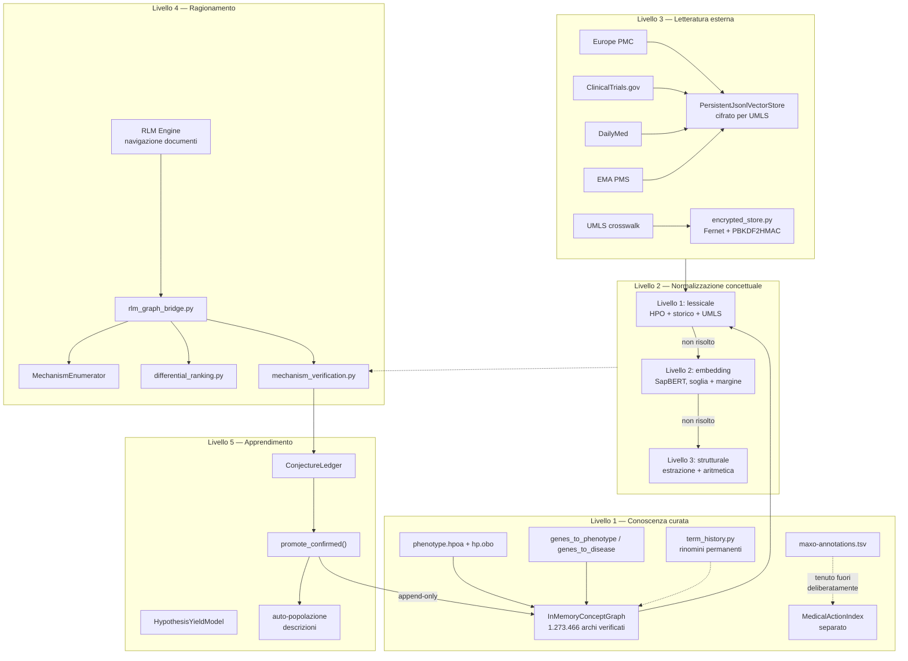
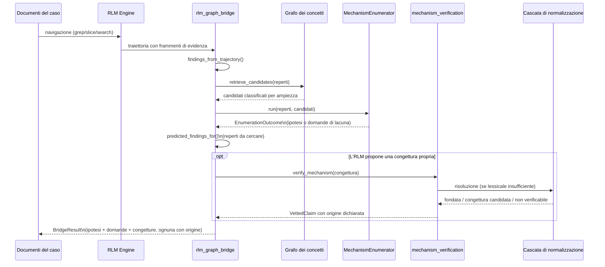
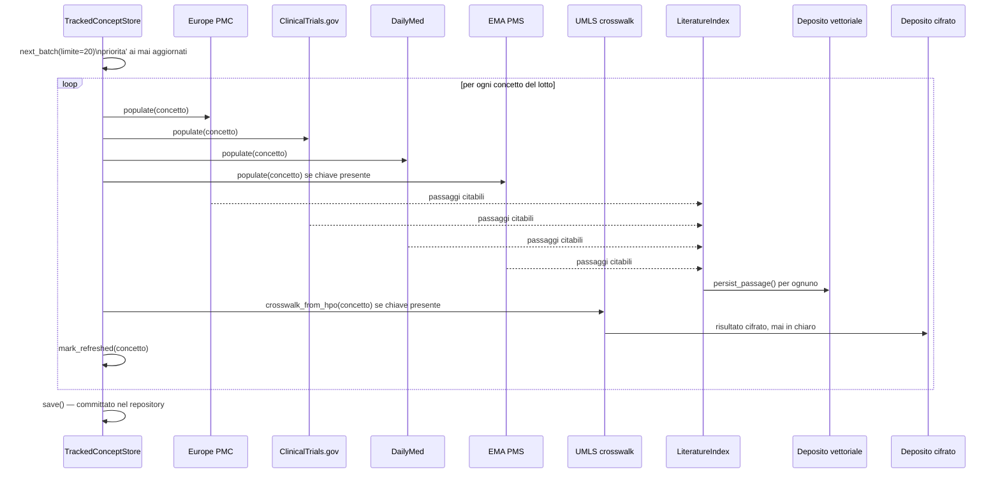
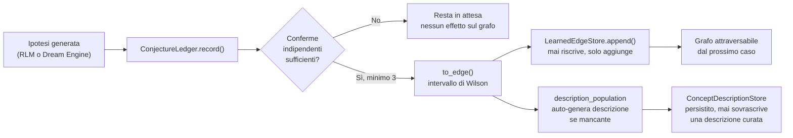

# Project Melampo — Trattato Tecnico di Architettura

**Un sistema diagnostico clinico assistito da intelligenza artificiale, progettato per un contesto regolato (MDR) in lingua italiana**

**Autore:** Francesco Lattari
**Repository:** [`francescoluciolattari/Melampo-AI`](https://github.com/francescoluciolattari/Melampo-AI)
**Versione del documento:** aggiornata al 16 settembre 2026
**Stato:** documento vivo, non definitivo — vedi nota di chiusura

---

## Nota metodologica, da leggere prima del resto

Questo trattato distingue esplicitamente due categorie di contenuto, e la distinzione è la garanzia di accuratezza dell'intero documento:

**Verificato**: ogni modulo descritto nelle Parti II–VII è stato letto riga per riga, testato con dati reali o realistici, e la sua descrizione qui riflette comportamento osservato — non intenzione dichiarata. Dove un collegamento fra due componenti è affermato, è perché è stato eseguito e il risultato osservato, quasi sempre con una citazione del codice o dell'output reale.

**Rilevato ma non verificato in questa sessione**: il repository contiene oltre 180 moduli Python. Una parte sostanziale — inclusi interi sottosistemi in `models/`, `orchestration/`, gran parte di `reasoning/` — non ha nemmeno un docstring di modulo, e non è stata letta in dettaglio nel lavoro che ha prodotto questo documento. La Parte VIII elenca questi moduli onestamente, per nome e percorso, senza inventare descrizioni del loro funzionamento. Dichiarare "non verificato" qui non è una lacuna del documento — è la sua garanzia di onestà.

Questa distinzione non è una formalità. Il lavoro che ha prodotto gran parte dell'architettura qui descritta ha trovato, ripetutamente, moduli costruiti con cura, testati, e mai collegati a nulla — a volte per mesi. Scrivere un trattato che presenta ogni file del repository come "funzionante" senza questa distinzione sarebbe il tipo esatto di errore che questo stesso progetto ha imparato, a fatica, a correggere.

---

## Indice

- **Parte I — Contesto e principi**
- **Parte II — Il livello di conoscenza curata (grafo, ontologie, cronologia dei termini)**
- **Parte III — La cascata di normalizzazione concettuale**
- **Parte IV — Il livello di letteratura esterna (connettori e persistenza)**
- **Parte V — Il motore di ragionamento (RLM, verifica dei meccanismi, ponte grafo↔documenti)**
- **Parte VI — Il ciclo di apprendimento e il Dream Engine**
- **Parte VII — Valutazione, sicurezza, automazione**
- **Parte VIII — Inventario onesto: cosa esiste ma non è stato verificato**
- **Parte IX — Flussi end-to-end (diagrammi)**
- **Parte X — Fonti esterne e bibliografia**


---

# Parte I — Contesto e principi

## 1.1 Scopo del sistema

Melampo è un sistema di supporto alla decisione diagnostica, pensato per un contesto clinico regolato secondo il Medical Device Regulation (MDR) europeo, in lingua italiana. Il suo compito non è sostituire il giudizio clinico, ma produrre — a partire dai reperti di un caso — un ventaglio di ipotesi diagnostiche ordinato per plausibilità, con la capacità esplicita di dichiarare incertezza quando i dati non bastano a concludere.

Il vincolo regolatorio non è periferico: attraversa ogni decisione architetturale documentata in questo trattato. Un sistema MDR-rilevante deve poter mostrare, per ogni affermazione che produce, **da dove viene** — non solo che è probabile, ma su quale prova poggia, e se quella prova è verificabile da un revisore umano. Questo vincolo spiega perché il progetto rifiuta ripetutamente scorciatoie che altri sistemi di intelligenza artificiale clinica adottano senza esitazione.

## 1.2 Principi architetturali ricorrenti

Nel corso dello sviluppo, alcuni principi sono emersi ripetutamente, indipendentemente dal modulo in questione. Vale la pena enunciarli qui una volta, perché ogni decisione successiva li applica senza ripeterli.

**Il grafo è il giudice, mai un modello.** Ogni volta che il sistema deve stabilire se un'affermazione clinica è fondata, la domanda viene posta al grafo di conoscenza — una struttura deterministica, ispezionabile, verificabile — non a un secondo modello linguistico chiamato ad arbitrare. Questo principio attraversa `mechanism_verification.py`, `root_model_cross_check.py`, e l'intera cascata di normalizzazione: un modello può **estrarre** struttura da un testo, non **giudicare** se due affermazioni coincidono.

**La provenienza deve restare sempre distinguibile.** Un arco importato da HPO e un arco appreso da conferme cliniche vivono in depositi separati (`graph_store.py`), anche se attraversabili come lo stesso grafo. Un'affermazione letta da un documento del paziente, una supportata dal grafo, e una proposta dal motore di ragionamento portano etichette di origine distinte (`rlm_graph_bridge.py`). Questa disciplina non è estetica: un revisore deve poter chiedere "perché il sistema crede questo?" e ricevere una risposta verificabile, non un'assicurazione.

**Il degrado deve essere sempre gentile, mai silenzioso.** Ogni connettore esterno, ogni livello della cascata di normalizzazione, ogni componente opzionale è stato costruito per riportare esplicitamente "non disponibile" quando manca una configurazione — mai per fallire con un'eccezione non gestita, e mai per fingere di funzionare producendo un risultato vuoto senza spiegazione.

**Verificare prima di costruire, misurare prima di assumere.** Il progetto ha una storia documentata di ipotesi rivelatesi sbagliate una volta verificate nel codice reale — un formato di file assunto invece che letto, un limite di frequenza attribuito al servizio sbagliato, un test che passava per il motivo sbagliato. Ogni sezione di questo trattato che descrive un comportamento lo fa perché quel comportamento è stato osservato, non dedotto.

**L'evoluzione della conoscenza è append-only.** Nulla in questo sistema riscrive silenziosamente ciò che ha imparato. Un arco appreso si aggiunge, non sostituisce; una rinomina di un termine ontologico si registra come sinonimo permanente, non come sostituzione; una congettura non confermata resta in attesa, non viene scartata.

## 1.3 Vincoli regolatori e di licenza, come premesse architetturali

Tre categorie di vincolo esterno hanno guidato scelte tecniche specifiche, documentate nelle parti successive:

- **UMLS** (Unified Medical Language System) impone alla parte licenziataria la responsabilità di proteggere i dati cui l'accesso è concesso — da cui la scelta di una cifratura reale a riposo (Parte VII) per ogni dato UMLS conservato localmente, non una precauzione facoltativa.
- **SNOMED CT** richiede l'appartenenza del paese a SNOMED International per un accesso senza costi aggiuntivi; lo stato dell'Italia non è stato confermato con certezza nelle verifiche svolte, e il sistema è stato progettato per non dipendere da SNOMED direttamente (Parte III).
- **Copyright e provenienza della letteratura**: ogni passaggio di letteratura conservato porta un identificativo verificabile indipendentemente (PMID, DOI, NCT, ecc.); un passaggio senza riferimento risolvibile viene conservato ma mai usato come prova (Parte IV).


---

# Parte II — Il livello di conoscenza curata

## 2.1 Il grafo dei concetti: struttura e scala reale

Il nucleo di conoscenza del sistema è un grafo non orientato di concetti clinici (`memory/concept_paths.py`, classe `InMemoryConceptGraph`), i cui archi sono attraversabili in entrambe le direzioni — un arco `malattia → ha_fenotipo → reperto` genera automaticamente l'arco inverso `reperto → inverse_ha_fenotipo → malattia`, con la stessa forza e lo stesso intervallo di confidenza.

**Costruzione dal dato reale.** Il grafo si costruisce da `phenotype.hpoa` (l'annotazione ufficiale dell'Human Phenotype Ontology, formato TSV con intestazione dichiarata) e, quando disponibile, da `hp.obo` (l'ontologia stessa, per risolvere gli identificativi HPO in nomi leggibili). Caricato dai dati reali presenti in questo repository:

```
1.273.466 archi, 29.053 concetti, caricamento in 6,1 secondi
di cui 333.983 archi derivati dalle annotazioni geniche
```

Questo numero non è teorico: è il risultato di un'esecuzione verificata di `memory/graph_sources.load_verification_graph()` sui file effettivamente presenti in `data/` in questo repository.

**Un difetto di prestazioni trovato e corretto.** La prima implementazione di `edges_from()` scandiva l'intera lista di archi due volte per ogni chiamata, ricalcolando la normalizzazione del testo su ogni arco — invisibile su un grafo di prova da 33 archi, e responsabile di un tempo di caricamento superiore ai 300 secondi (interrotto) sul grafo reale. Corretto indicizzando gli archi per concetto normalizzato alla costruzione (`__post_init__`), portando il tempo a 2,8 secondi sul solo `phenotype.hpoa`.

## 2.2 Fonti di dati integrate nel grafo

| Fonte | File | Cosa aggiunge | Relazione prodotta |
|---|---|---|---|
| HPO Annotations | `phenotype.hpoa` | Associazioni malattia↔fenotipo, con frequenza quando documentata | `has_phenotype` |
| HPO Ontology | `hp.obo` | Nomi leggibili, sinonimi curati (inclusi quelli in linguaggio comune), gerarchia `is_a` | — (arricchisce le etichette, non produce archi propri) |
| Gene-Phenotype | `genes_to_phenotype.txt` | Associazioni gene↔fenotipo | `associated_gene` |
| Gene-Disease | `genes_to_disease.txt` | Associazioni gene↔malattia (nomi recuperati da `phenotype.hpoa`, dato che il file stesso non li contiene) | `causes_disease` |
| MAxO Annotations | `maxo-annotations.tsv` | Azioni mediche (trattamenti, controindicazioni) — **tenute deliberatamente fuori dal grafo diagnostico** | (deposito separato, `MedicalActionIndex`) |

**Perché MAxO è escluso dal grafo.** Misurato direttamente: delle 438 righe del file, 401 sono `TREATS`, 34 `PREVENTS`, e una sola `CONTRAINDICATED` — nessuna relazione diagnostica, copertura dell'1,6% delle malattie note. Includere relazioni di trattamento nello stesso grafo di `has_phenotype` permetterebbe a un differenziale di attraversare "malattia → trattata con → terapia → tratta → altra malattia" e dichiarare due condizioni correlate solo perché condividono una terapia — non un collegamento diagnostico. `medical_actions.MedicalActionIndex` conserva questi dati separatamente, con `cautions_for()` che isola specificamente le righe di controindicazione.

## 2.3 Un ostacolo strutturale, non risolto

HPO produce **un solo tipo di relazione semanticamente ricca**, `has_phenotype`. Non codifica catene causali meccanicistiche (`granuloma → attività 1-alfa-idrossilasi → calcitriolo in eccesso`) — esattamente ciò che un banco di vaglio diagnostico deve verificare. Questo limite resta aperto: collegare il grafo reale ha risolto un problema di scala, non di tipo di conoscenza.

## 2.4 Cronologia dei termini: nulla va perso a un rinomino

`memory/term_history.py` risponde a un principio dichiarato esplicitamente durante lo sviluppo: **un termine rinominato non deve mai smettere di essere riconoscibile sotto il nome che aveva prima**. Ogni rinomina o obsoletizzazione rilevata fra due release consecutive di HPO viene registrata in modo permanente, append-only (`term_renames.jsonl`, `term_obsoletions.jsonl`), e ogni nome storico diventa un sinonimo che la cascata di normalizzazione riconosce automaticamente.

Verificato su due rinomine successive dello stesso termine: entrambi i nomi storici restano risolvibili, non solo l'ultimo.


---

# Parte III — La cascata di normalizzazione concettuale

## 3.1 Il problema che risolve

Un modello di vaglio scrive *"impaired methylcobalamin-dependent methionine synthase activity"*; il nodo del grafo si chiama `impaired myelin synthesis`. Clinicamente la stessa affermazione, lessicalmente senza nulla in comune. Il confronto testuale esatto — l'unico esistente fino a questo lavoro — non può colmare questa distanza, e non deve farlo in modo permissivo: un confronto troppo tollerante reintrodurrebbe esattamente il problema che questo progetto ha misurato all'inizio (corrispondenze per somiglianza superficiale che confondono concetti clinicamente distinti).

`memory/concept_normalisation.py` risolve questo con tre livelli, **ordinati per determinismo, non solo per costo**: il livello meno riproducibile viene interrogato solo su ciò che i livelli riproducibili non hanno risolto.

## 3.2 Livello 1 — Lessicale, arricchito da tre fonti curate

Il confronto di base (`concept_names_match`: uguaglianza esatta → contenimento → uguaglianza per insieme di parole) resta il primo tentativo, invariato. Ma ora viene verificato non solo contro l'etichetta nuda del nodo, bensì contro tre fonti di sinonimi curati, tutte deterministiche:

1. **Sinonimi HPO**, inclusi quelli in linguaggio comune (`include_layperson=True`) — un difetto trovato e corretto: il parser leggeva già la parola "layperson" ma la scartava, mai salvata da nessuna parte.
2. **Cronologia dei rinomini** (Parte 2.4).
3. **UMLS crosswalk** — la scoperta più rilevante di questa parte del lavoro.

**UMLS senza bisogno di una licenza SNOMED diretta.** `connectors/umls.py` interroga l'endpoint `/crosswalk` della UTS REST API, che prende **direttamente un codice HPO** — quello che ogni nodo del nostro grafo già possiede — e restituisce i codici equivalenti in qualunque altro vocabolario UMLS conosca, SNOMED CT incluso quando disponibile. Verificato contro l'esempio ufficiale della documentazione NLM:

```
crosswalk(HP:0001947) -> 233604007 "Renal tubular acidosis" (SNOMEDCT_US)
                          CUI condiviso: C0022099
```

Il risultato entra nella cascata **restando nel livello lessicale**: è un confronto contro un sinonimo curato da un'autorità esterna, non una stima. Un test costruito appositamente conferma che senza UMLS configurato la stessa frase non si risolve — isolando davvero il contributo di questo livello, dopo che una prima versione del test era passata per il motivo sbagliato (la frase scelta combaciava già con il confronto per insieme di parole esistente).

## 3.3 Livello 2 — Similarità per incorporamento (SapBERT)

Quando nessun sinonimo curato copre la frase, il secondo livello confronta vettori di significato tramite un modello bi-encoder auto-allineato sui pari di sinonimi UMLS (SapBERT). Deterministico a runtime — stessa frase, stesso vettore, sempre — anche se appreso.

**Due protezioni, non una.** Una soglia assoluta di similarità (0,85 di default) e un **margine dal secondo classificato** (0,05). La seconda protezione è nata da un difetto reale trovato durante il test: con un incorporatore degenere che assegna lo stesso vettore a tutto, ogni concetto ottiene similarità 1,0, supera qualunque soglia, e vince il primo incontrato per caso. La soglia da sola giudica il vincitore isolatamente; il margine giudica se un vincitore esisteva davvero.

## 3.4 Livello 3 — Confronto strutturale

L'ultima risorsa, e quella con il disegno più delicato: invece di chiedere a un modello *"queste due frasi significano la stessa cosa?"* — arbitrato non verificabile — un modello **estrae** entità e relazioni da entrambi i lati (la frase del candidato, la descrizione in cache del concetto), e il confronto fra le due strutture è aritmetica pura (`compare_structures`, sovrapposizione pesata 65% sulle relazioni, 35% sulle entità — le relazioni condivise indicano lo stesso meccanismo, le entità condivise solo lo stesso argomento).

**Un formato canonico condiviso**, proposto durante lo sviluppo per un motivo preciso: se le descrizioni in cache fossero estratte con una convenzione e le affermazioni dei modelli arrivassero con un'altra, due strutture che descrivono lo stesso meccanismo otterrebbero un punteggio basso, e il fallimento sembrerebbe disaccordo clinico invece che disallineamento tecnico. `description_population.canonical_format_example()` genera il frammento di prompt **dalla stessa forma dati** che l'estrattore produce, così le due parti non possono disallinearsi silenziosamente. Un modello di vaglio può emettere la propria struttura direttamente (`STRUCTURE: {...}` accanto alla prosa) — verificato che in quel caso l'estrattore non viene nemmeno chiamato, e il confronto resta comunque aritmetico: **emettere una struttura non permette a un modello di auto-valutarsi**, perché non vede mai la descrizione con cui verrà confrontato.

**L'estrattore reale**: `memory/structural_extraction.py`, chiamata HTTP isolata, stesso schema di ogni altro connettore di questo progetto — trasporto lasciato alla configurazione del deployment, degrado sempre gentile.

**Popolamento massivo delle descrizioni**: `hp.obo` porta una definizione curata per 17.441 termini, ciascuna con un riferimento PMID — dato già scaricato, mai letto dal parser fino a questo lavoro. `description_population.populate_from_ontology()` estrae struttura da queste definizioni una volta, per riuso permanente. Verificato sui dati reali: 456 descrizioni popolate dai primi 500 termini.

**Popolamento automatico per evoluzione**: ogni volta che `DiagnosticAssembly.promote_confirmed()` promuove un nuovo arco — dal Dream Engine o da una nuova congettura confermata — viene generata e salvata automaticamente una descrizione per i concetti coinvolti, se non ne esiste già una (Parte VI).


---

# Parte IV — Il livello di letteratura esterna

## 4.1 Principio: recupero, mai addestramento

Quattro ragioni, verificate una per una nel corso dello sviluppo, escludono l'addestramento di un modello sulla letteratura come meccanismo di aggiornamento:

1. **La letteratura invecchia più in fretta di quanto un modello possa essere riaddestrato.** Un indice vettoriale si aggiorna aggiungendo un documento; un modello richiede un ciclo di addestramento completo.
2. **L'addestramento funzionerebbe solo su pesi accessibili** — mai su un modello con API chiusa. Se il doppio controllo dovesse mai estendersi al ruolo di vaglio, due motori arricchiti in modo diseguale smetterebbero di essere confrontabili sulla stessa base.
3. **Un peso non ha una citazione.** Un passaggio recuperato porta sempre titolo, identificativo, data — un revisore può aprirlo e verificarlo. Un peso addestrato no.
4. **Il rischio è già documentato in questo stesso progetto**: un modello di navigazione candidato è stato escluso proprio perché l'affinamento medico ne erodeva l'aderenza al formato.

## 4.2 I cinque connettori, verificati contro le rispettive API ufficiali

| Connettore | Fonte | Copertura | Chiave richiesta | Limite di frequenza verificato |
|---|---|---|---|---|
| `europe_pmc.py` | Europe PMC (EBI) | PubMed + PMC full-text + preprint, dichiara di ingerire tutto PubMed | Mai richiesta | **10 richieste/secondo, 500/minuto** — confermato dallo staff EBI |
| `clinical_trials.py` | ClinicalTrials.gov v2 | Registro studi clinici USA (NIH/NLM) | Mai richiesta | Nessun limite unico documentato; mantenuto prudente |
| `dailymed.py` | DailyMed (FDA) | Etichette farmaci USA, formato SPL | Mai richiesta | Nessun limite pubblicato; mantenuto prudente |
| `pms_ema.py` | EMA Product Management Service | Farmaci autorizzati centralmente nell'UE, FHIR R5, **beta pubblica confermata attiva** (verificato contro il FAQ ufficiale EMA di luglio 2026) | **Richiesta** (`PMS_EMA_API_KEY`) | Nessun limite pubblicato in fase beta; mantenuto prudente |
| `umls.py` | UMLS UTS (NLM) | Crosswalk fra vocabolari via CUI condiviso | **Richiesta** (`UMLS_API_KEY`) | Non documentato; ogni chiamata cifrata e conservata in cache |

**Una correzione registrata direttamente nel codice**: un limite di 3 richieste al secondo, inizialmente attribuito a Europe PMC/ClinicalTrials.gov, apparteneva in realtà a NCBI E-utilities — un servizio diverso, usato da un connettore diverso (`pmc_case_reports.py`, per i banchi di valutazione, non per la letteratura). L'errore è stato trovato, verificato con fonti dirette, e corretto sia nel codice sia nella documentazione.

**DailyMed ed EMA PMS sono complementari, non sovrapposti.** DailyMed copre il formulario FDA statunitense; EMA PMS copre i farmaci autorizzati a livello centralizzato nell'Unione Europea. Per un contesto clinico italiano, EMA PMS è la fonte più direttamente autorevole delle due — un farmaco autorizzato in UE e prescritto in Italia potrebbe non avere alcuna voce in DailyMed.

## 4.3 Persistenza: un deposito vettoriale già esistente, mai collegato

Un controllo diretto ha trovato che `LiteratureIndex` non aveva alcuna persistenza — viveva solo in memoria di processo. La scoperta più significativa: **`memory/vector_memory.py`, un deposito vettoriale completo con Weaviate indicato come backend di produzione consigliato, esisteva da mesi e non era mai stato istanziato in produzione** — lo stesso schema "costruito e mai collegato" riscontrato ripetutamente in questo progetto.

`memory/literature_persistence.py` collega i due, con una distinzione di disegno deliberata: il deposito vettoriale viene usato **solo per l'immagazzinamento**, mai per la ricerca. La ricerca per similarità di embedding di quel deposito è esattamente ciò che `LiteratureIndex` aveva già rifiutato per la pertinenza — misurato in questo stesso progetto: una ricerca su "scompenso cardiaco" può restituire "sindrome coronarica acuta" per vicinanza statistica, non pertinenza clinica. La ricerca resta concettuale; solo la sopravvivenza al riavvio cambia.

Verificato con un riavvio simulato reale: un passaggio persistito da un'istanza del deposito, caricato da una **seconda istanza indipendente**, si trova ancora tramite il confronto concettuale ordinario.

## 4.4 La coda dei concetti tracciati — aggiornamento in stile Dream Engine

`memory/tracked_concepts.py` non è un elenco semplice, ma una coda con priorità: ogni concetto porta quando è stato tracciato, da dove, e quando aggiornato l'ultima volta. `next_batch()` dà priorità ai mai aggiornati, poi ai più vecchi. Seminata dai ~40 concetti già presenti nel banco di vaglio, cresce organicamente man mano che nuovi casi vengono trattati o nuovi archi promossi — mai una scansione cieca dell'intero grafo (29.053 concetti).

Il workflow automatico giornaliero (`.github/workflows/data-and-dependency-updates.yml`, job `refresh-literature`) esegue questo ciclo ogni notte su un lotto limitato (20 concetti), interrogando tutti e cinque i connettori, pre-riscaldando la cache UMLS cifrata per gli stessi concetti, e **committa il risultato nel repository** — una decisione dichiarata esplicitamente come inversione di una scelta precedente: senza persistenza reale, non committare era corretto; con la persistenza reale appena costruita, non farlo significherebbe ricominciare da zero ogni notte.


---

# Parte V — Il motore di ragionamento

## 5.1 RLM: navigazione ricorsiva senza esecuzione di codice

`reasoning/rlm_engine.py` implementa la navigazione dei documenti del caso tramite una grammatica d'azione chiusa e verificata (`grep`, `slice`, `search`, `describe`, `expand`, `query`, `final`) — mai esecuzione di codice arbitrario, ogni mossa controllata contro archi reali del contesto documentale. Questo è il motore che legge i referti di un singolo caso.

**Stato di collegamento a un modello reale, verificato**: `reasoning/rlm_wiring.py` — il file dedicato a legare il motore a un modello di navigazione vivo — **non contiene alcuna assegnazione di `root_model` a un modello reale** al momento di questa verifica. La scelta del modello di navigazione (Nemotron-3-Super, con Gemma-3-27b nel doppio controllo) è stata presa sulla base di banchi di confronto documentati, ma il collegamento operativo in questo file resta da completare.

## 5.2 Verifica dei meccanismi contro il grafo, non contro il testo

`reasoning/mechanism_verification.py`, funzione `verify_mechanism()`: prende un fattore, un bersaglio, e un meccanismo dichiarato in testo libero, risolve fattore e bersaglio a nodi reali del grafo (`resolve_concept`), percorre il grafo con attivazione diffusiva vincolata (`spreading_activation.py`) per trovare concetti mediatori plausibili, e confronta il meccanismo dichiarato contro quei mediatori — prima lessicalmente, poi (se una cascata è configurata) tramite i livelli 2 e 3 descritti nella Parte III.

Quattro esiti possibili, distinti esplicitamente: `supported` (fondato), `connection_without_this_mechanism` (il grafo conosce una connessione ma non questo meccanismo specifico), `no_connection` (nessuna connessione trovata), `not_checkable` (fattore o bersaglio non risolvibili nel grafo).

## 5.3 Il ponte fra i documenti del paziente e il grafo

`reasoning/rlm_graph_bridge.py` risolve una lacuna identificata esplicitamente durante lo sviluppo: l'RLM legge i documenti e non tocca mai il grafo; l'enumeratore percorre il grafo e non legge mai un documento. Due metà complete di un ragionatore diagnostico, senza percorso fra loro.

Il ponte funziona in tre direzioni:

1. **Documenti → grafo**: i reperti individuati dall'RLM (letti dai frammenti di evidenza della traiettoria, non solo dalla risposta finale) diventano i punti d'ingresso per `candidate_retrieval.retrieve_candidates()`, che risale gli archi inversi del grafo e raccoglie le malattie collegate — usando la **direzione** dell'arco, non i nomi delle relazioni, per non proporre mai un sintomo come diagnosi.
2. **Grafo → documenti**: un'ipotesi classificata in alto predice reperti che dovrebbero essere presenti se è corretta — `predicted_findings_for()` li restituisce, escludendo quelli già osservati, trasformando una classifica statica in qualcosa di verificabile.
3. **Congetture dell'RLM verso il grafo**: quando l'RLM propone una connessione propria (non richiesta, notata leggendo i documenti), passa attraverso **lo stesso** `verify_mechanism()` usato per qualunque altro modello — nessuna corsia preferenziale per le idee del motore stesso. Tre esiti: fondata, congettura candidata (il grafo conosce entrambi i concetti ma non la connessione — materiale per il ciclo di apprendimento), o non verificabile.

Ogni parte dell'output dichiara la propria origine (`read_from_document`, `supplied_by_graph`, `proposed_by_rlm`) — mai confusa con le altre.

## 5.4 Generazione di ipotesi per enumerazione dei cammini

`training/mechanism_enumeration.py`, classe `MechanismEnumerator`: dato un insieme di reperti e un insieme di candidati (forniti da `candidate_retrieval` o da un chiamante), percorre il grafo e produce un `EnumerationOutcome` in una di due modalità, decisa automaticamente dalla densità locale del grafo:

- **`clinical_hypotheses`**: quando il grafo ha densità sufficiente, un ventaglio di ipotesi classificate con supporto e plausibilità calcolati da cammini reali.
- **`knowledge_gap_questions`**: quando la densità è insufficiente, **il sistema si astiene** ed emette domande su quali collegamenti servirebbe accertare, invece di classificare rumore.

Verificato con un banco dedicato (`evaluation/enumeration_bench.py`): entrambe le modalità funzionano correttamente sul grafo di prova, inclusa l'astensione quando appropriato.

## 5.5 Discriminazione fra patologie senza bisogno di una fonte diagnostica separata

Una domanda sollevata direttamente durante lo sviluppo — è necessaria una fonte dati specificamente diagnostica, o basta osservare i sintomi e discriminare contro ciò che il grafo già associa? — ha una risposta confermata, non presunta: **il metodo di similarità fenotipica pesata per specificità (Information Content) è il metodo stabilito in bioinformatica clinica**, alla base di strumenti come Phenomizer, e usa esattamente ciò che questo progetto aveva già costruito.

`memory/differential_ranking.py` classifica i candidati per la somma pesata (per specificità) dei reperti effettivamente condivisi con il caso — non per conteggio grezzo, che tratterebbe un reperto raro quanto uno comune. Verificato sul grafo reale: Marfan syndrome, contractural arachnodactyly congenita, ed ectopia lentis familiare risultano a pari merito su tre reperti classici di Marfan — comportamento clinicamente corretto, non un difetto: con solo tre reperti generici, questi **sono** differenziali genuinamente difficili da separare nella pratica clinica reale.


---

# Parte VI — Il ciclo di apprendimento e il Dream Engine

## 6.1 Cosa il Dream Engine è, e cosa non è

Chiarito esplicitamente durante lo sviluppo: il Dream Engine **non è** il generatore di ipotesi per la diagnosi in tempo reale. È un processo che gira su calcolo inutilizzato, analizza referti di **pazienti diversi** nel tempo, cerca collegamenti nascosti e non ovvi, e fa evolvere il grafo di conoscenza o un modello complementare di intuizione. L'RLM-grafo (Parte V) è il modello operativo che percorre il grafo durante una richiesta reale; il Dream Engine arricchisce il grafo **fra** le richieste, non durante.

Il ponte fra i due tempi è deterministico: quando una connessione scoperta offline supera la verifica (tre conferme indipendenti), diventa un arco vero, e da quel momento l'RLM-grafo lo attraversa come qualunque altro arco, senza sapere che è nato da un'esplorazione notturna.

## 6.2 Il ciclo di promozione delle congetture

`training/conjecture_ledger.py`, classe `ConjectureLedger`: registra ogni salto ipotetico che un'ipotesi incarna (`source`, `target`, mediatori, numero di salti), lo mette alla prova contro conferme cliniche indipendenti, e lo promuove ad arco vero solo dopo un minimo di conferme (default: tre) da fonti distinte. L'arco promosso porta un intervallo calcolato con il metodo di Wilson dalle conferme reali — non un valore secco — e la propria provenienza (`learned:caso:conferme=N`), distinguibile per sempre da un arco importato.

`memory/graph_store.py` persiste gli archi appresi in un deposito separato da quello importato, con una motivazione precisa: lo strato importato è **derivabile** (rigenerabile da una release HPO più recente in qualunque momento); lo strato appreso **non lo è** — è il prodotto accumulato di casi confermati, l'unico dato realmente insostituibile in questo sistema. Un aggiornamento della release HPO non deve mai poter cancellare ciò che il sistema ha imparato.

**Verificato attraverso un riavvio simulato reale**: un caso viene eseguito, le sue ipotesi vengono registrate come congetture, tre conferme indipendenti arrivano, `promote_confirmed()` scrive un arco con il proprio intervallo di Wilson e la provenienza — e un processo assemblato da capo lo vede.

## 6.3 Popolazione automatica delle descrizioni ad ogni promozione

Collegato direttamente a questo ciclo: ogni volta che un arco viene promosso — che la congettura originaria venga dal Dream Engine o da una nuova ipotesi RLM confermata — `DiagnosticAssembly.promote_confirmed()` genera automaticamente una descrizione strutturale (Parte 3.4) per i concetti coinvolti, se non ne esiste già una, usando la propria giustificazione (cosa è stato confermato, da quanti casi) come testo sorgente per l'estrazione. Una descrizione già curata non viene mai sovrascritta.

## 6.4 Apprendimento da quali forme di ipotesi risultano confermate

`training/hypothesis_yield.py`, classe `HypothesisYieldModel`: impara, da esiti confermati nel tempo, quali *forme* di ipotesi (non quali ipotesi specifiche) tendono a essere confermate — non una rete neurale appresa per gradiente, ma un modello statistico trasparente sugli stessi intervalli di Wilson usati altrove nel progetto, per coerenza con l'esigenza di auditabilità normativa.

## 6.5 Una discrepanza architetturale, dichiarata onestamente — e una correzione successiva alla prima stesura

Verificato direttamente per questo documento: `training/dream_trainer.py` espone un punto di aggancio (`enumerator: Any = None`) pensato per ricevere un `MechanismEnumerator` reale — quando presente, il Dream Trainer enumera ipotesi vere dal grafo invece di ricadere su etichette segnaposto di ripiego. `reasoning/diagnostic_assembly.py` (Parte 6.2) fornisce `dream_context_for()`, una funzione pensata esattamente per alimentare questo aggancio con candidati recuperati dal grafo.

**Il punto reale in cui `DreamTrainer` viene istanziato in questo repository** — `reasoning/clinical_pipeline.py`, dentro `_build_runtime_components()` — **non passa `enumerator=`**. Il Dream Trainer, nella pipeline in produzione, cade ancora sul ramo di ripiego con etichette segnaposto.

**Correzione rispetto alla prima stesura di questa sezione**: qui si affermava l'esistenza di "due catene parallele non riconciliate", citando `clinical_pipeline.py` e `clinical_pipeline_refined.py` come pari. Un'indagine successiva, richiesta esplicitamente e condotta con la cronologia Git, ha trovato che `clinical_pipeline_refined.py` non era una seconda catena in uso, ma **codice orfano**: creato otto giorni dopo `clinical_pipeline.py` (non prima), toccato da due soli commit contro sedici, e — punto decisivo — **mai importato da `app.py`, da alcun test, o da qualunque altro modulo**. `app.py`, il vero punto d'ingresso dell'applicazione (`build_default_runtime()`), costruisce ed usa esclusivamente `ClinicalInferencePipeline` da `clinical_pipeline.py`, con tutte e sedici le sue dipendenze concrete. Il file `clinical_pipeline_refined.py` è stato rimosso da questo repository per questo motivo, e non compare più.

Resta quindi **una sola catena in produzione** — `clinical_pipeline.py`, tramite `app.py` — e la vera domanda architetturale aperta è più semplice di quanto sembrasse: se e come `diagnostic_assembly.py` (verificata end-to-end in questo lavoro, con persistenza reale, cascata di normalizzazione completa, e ciclo di apprendimento chiuso) debba sostituire o integrarsi con `clinical_pipeline.py`, l'unica pipeline oggi realmente collegata all'applicazione. Non risolta in questo documento — e va trattata come tale, non presunta.

## 6.6 Il motore neuro-vettoriale di evoluzione delle ipotesi

Proposto inizialmente come uno "strato neuro-quantistico" che avrebbe fatto evolvere i vettori delle ipotesi diagnostiche con l'equazione di Schrödinger e il formalismo di Dirac, misurando la loro sovrapposizione con l'integrale di overlap quantistico. Respinto **su base tecnica**, non estetica, prima di essere costruito, per due ragioni verificate:

**Matematicamente non avrebbe aggiunto nulla.** L'integrale di sovrapposizione quantistica, $\langle\psi_A|\psi_B\rangle = \int \psi_A^*(x)\psi_B(x)\,dx$, è il prodotto interno di due funzioni. Per vettori a valori reali — quali sono, qui e ovunque in questo progetto, i vettori diagnostici — quel prodotto interno **è** il prodotto scalare, e normalizzato **è** il coseno di similarità: la stessa identica operazione già usata dall'infrastruttura di `vector_memory.py` e dal livello 2 della cascata di normalizzazione (SapBERT, Parte 3.3). Scriverlo in notazione bra-ket non avrebbe calcolato nulla di diverso — avrebbe solo implicato un processo fisico, una fase complessa, e una sovrapposizione quantistica assenti in quello che resta, di fatto, un punteggio di similarità fra due vettori ordinari.

**Fisicamente la costante non si applica.** L'equazione di Schrödinger dipendente dal tempo, $i\hbar \frac{d}{dt}|\psi(t)\rangle = \hat{H}|\psi(t)\rangle$, descrive come lo stato quantistico di un sistema fisico **reale** evolve sotto un Hamiltoniano che rappresenta l'energia di quel sistema. $\hbar$ ($\approx 1{,}0546\times10^{-34}$ J·s) è una costante fisica dell'universo, non un parametro libero da riutilizzare. Non esiste un Hamiltoniano per "un'ipotesi diagnostica", e nessuna energia fisica viene conservata quando un'ipotesi si aggiorna.

**Cosa è stato costruito al suo posto**: `training/vector_evolution_engine.py` — matematicamente equivalente a quanto proposto, con un nome e una documentazione che riflettono cosa fa davvero. Due modelli reali e citabili, non metaforici:

- **Integratore leaky** (Dayan & Abbott, *Theoretical Neuroscience*, 2001 — il modello standard di come il potenziale di membrana di un neurone accumula segnale sinaptico decadendo verso una base) per l'evoluzione continua nel tempo: `leaky_integrate()` risolve in forma chiusa l'equazione $\frac{dv}{dt} = -\frac{v - \text{input}}{\tau}$ — una vecchia evidenza decade esponenzialmente verso la nuova, mai sostituita di netto.
- **Rinforzo hebbiano** (Hebb, *The Organization of Behavior*, 1949 — "i neuroni che si attivano insieme si collegano insieme") per il caso d'uso richiesto specificamente: quando una correlazione fra due casi trovata da questo spazio viene confermata clinicamente, `hebbian_reinforce()` avvicina i due vettori, così lo spazio migliora nel trovare correlazioni simili in futuro — applicato solo su conferme reali, mai su ogni confronto, per la stessa ragione per cui un arco del grafo richiede conferme multiple prima di essere promosso (Parte 6.2).

**La scoperta di correlazioni fra casi**, l'obiettivo dichiarato della richiesta originale, funziona esattamente come descritto concettualmente: `HypothesisVectorSpace.find_cross_case_correlations()` confronta ogni coppia di ipotesi **provenienti da casi diversi** (mai due ipotesi dello stesso differenziale, che si sovrapporrebbero per costruzione, non per scoperta) e restituisce quelle sopra una soglia di coseno di similarità. Verificato con un esempio concreto: due ipotesi testualmente diverse ("sarcoidosi polmonare" da un caso, "sarcoidosi con coinvolgimento polmonare" da un altro) vengono trovate correlate automaticamente.

**Persistenza append-only, cifrata.** Ogni aggiornamento o rinforzo si registra come evento, mai sovrascrive — lo stato corrente si ricostruisce ripercorrendo il registro, la stessa disciplina di `graph_store.py` e `term_history.py`. Il registro usa `encrypted_store.py` (Parte 7.2): un vettore d'ipotesi deriva da un caso clinico reale, e in un contesto regolato MDR merita la stessa protezione a riposo già data ai dati UMLS, non uno standard inferiore perché il contenuto è numerico anziché testuale.

**Collegato a `DiagnosticAssembly`** come capacità opzionale e additiva (`vector_space: Any = None`) — `record_hypothesis_vector()` e `cross_case_correlations()` degradano in modo gentile a `None`/lista vuota quando non configurato, senza richiedere a chi chiama di controllare prima se il componente esiste.


---

# Parte VII — Valutazione, sicurezza, automazione

## 7.1 I banchi di misurazione

Tre banchi distinti misurano tre compiti diversi, deliberatamente separati perché premiano comportamenti diversi:

**`evaluation/format_adherence_bench.py`** — misura se un candidato può navigare l'ambiente documentale nella grammatica d'azione richiesta. Ha selezionato Nemotron-3-Super come modello di navigazione primario, con Gemma-3-27b nel doppio controllo.

**`evaluation/vetting_bench.py`** — misura il vaglio: dato un fattore, un bersaglio, e un meccanismo proposto, il grafo conferma o smentisce. Versione 2, ampliata dopo che due esecuzioni dal vivo avevano rivelato una fixture troppo piccola: **16 casi su dieci sistemi d'organo**, con tre casi di **trattenimento** deliberato (dove la risposta corretta è dichiarare che non esiste connessione) — misurato con un intervallo di confidenza di Wilson sia sulla fondatezza sia sul trattenimento, non un numero secco.

Un audit ha inoltre scoperto che il banco di vaglio inviava per errore il prompt di sistema del banco di *navigazione* — descrivendo un ambiente documentale inesistente — spiegando gran parte del comportamento anomalo osservato in tre esecuzioni precedenti. Corretto con un prompt di sistema dedicato.

**`evaluation/enumeration_bench.py`** — misura la generazione del ventaglio differenziale stesso: richiamo (la diagnosi confermata compare?), classifica (è vicina alla cima?), trattenimento (il sistema si astiene quando il grafo non può concludere?), qualità delle domande poste in astensione.

## 7.2 Cifratura a riposo per i dati soggetti a licenza

`memory/encrypted_store.py` fornisce cifratura reale, non un'apparenza: Fernet (AES-128 in modalità CBC con HMAC, dalla libreria `cryptography`), chiave derivata dalla password tramite PBKDF2HMAC a 600.000 iterazioni (il minimo raccomandato OWASP 2023) — mai la password usata direttamente come chiave. Un sale casuale per deposito, generato una volta e riusato ad ogni riapertura.

Verificato direttamente: il file su disco non contiene alcun testo in chiaro riconoscibile; una password sbagliata solleva un errore esplicito invece di restituire silenziosamente nulla. Usato oggi per la cache dei risultati UMLS (`memory/umls_cache.py`), l'unico dato in questo progetto soggetto a un vero obbligo contrattuale di protezione.

## 7.3 Automazione: due cadenze distinte per due velocità di cambiamento reali

`.github/workflows/data-and-dependency-updates.yml` esegue due cicli su programmazioni diverse, deliberatamente non unificate: settimanale per i dati HPO e le dipendenze Python (le release HPO escono ogni 6-10 settimane); giornaliero per la letteratura (PubMed e i registri di studi clinici cambiano ogni giorno).

Il ciclo settimanale **apre sempre una pull request**, mai un commit diretto — una release HPO può rinominare decine di termini in blocco, e un aggiornamento automatico silenzioso sposterebbe ogni numero a valle senza che nessun revisore veda la differenza. La suite di test completa gira contro i nuovi dati prima che la richiesta si apra.

Il ciclo giornaliero interroga tutti e cinque i connettori di letteratura per un lotto limitato di concetti tracciati, pre-riscalda la cache UMLS cifrata, e committa il risultato — con la motivazione della scelta di committare dichiarata esplicitamente nel codice stesso, come inversione consapevole di una decisione precedente (Parte 4.4).


---

# Parte VIII — Inventario onesto: cosa esiste ma non è stato verificato

## 8.1 La dimensione del non verificato, con i numeri esatti

Il repository contiene **180 moduli Python** in `src/melampo/`. Di questi, **64 (36%) portano un docstring di modulo** e sono stati letti, testati e verificati nel lavoro che ha prodotto questo documento — sono descritti nelle Parti II–VII. I restanti **116 (64%) non hanno alcun docstring di modulo**, e la loro descrizione qui si limita al nome del file e della cartella che li contiene — mai a un'affermazione su cosa facciano o se siano collegati a qualcos'altro.

Questa non è una lista di moduli inutili o abbandonati — molti nomi suggeriscono lavoro serio e specifico (`pathology_encoder.py`, `illness_script.py` con docstring, `metacognition.py`). È, semplicemente, lavoro che precede questa sessione di sviluppo e che questo trattato non può descrivere onestamente senza averlo letto.

**Un'eccezione, aggiornata rispetto alla prima stesura di questa parte**: `models/quantum_belief_layer.py` e `models/quantum_research.py` **sono stati letti per intero** in un'indagine successiva, richiesta esplicitamente. Il primo dichiara nel proprio docstring di non rivendicare un'implementazione quantomeccanica letterale, ed è in realtà una combinazione lineare pesata di punteggi scalari con terminologia presa in prestito dal lessico quantistico; il secondo è un segnaposto di nove righe. Nessuna equazione di Schrödinger, nessuna notazione di Dirac, nessun formalismo quantistico reale in nessun punto del repository — verificato con una ricerca su tutto il codice. La Parte 6.6 descrive il motore reale (`vector_evolution_engine.py`, integratore leaky più rinforzo hebbiano) costruito appositamente per la capacità che era stata richiesta con terminologia quantistica, con matematica onesta al suo posto.

## 8.2 Sottosistemi interamente non verificati in questa sessione

**`models/` — 24 file su 25 senza docstring.** Nomi che suggeriscono un intero sottosistema di codifica multimodale e classificazione clinica: `pathology_encoder.py`, `volume_encoder.py`, `report_encoder.py`, `text_encoder.py`, `fusion.py`, `fusion_adapter.py`, `decision_head.py`, `prototype_head.py`, `evidence_ranker.py`, `risk_gate.py`, `abstention.py`, `calibration.py`, `uncertainty.py`, `quantum_belief_layer.py`, `quantum_research.py`, `statistical_dreamer.py`, `imaging_provider_selector.py`, `local_imaging_provider.py`, `remote_imaging_provider.py`, `specialist_adapters.py`, `model_card.py`, `model_client.py`, `model_response_schema.py`, `retrieval_adapter.py`.

**`orchestration/` — 10 file su 10 senza docstring.** `a2a_adapter.py`, `bootstrap.py`, `contracts.py`, `mcp_adapter.py`, `model_execution_trace.py`, `model_router.py`, `runtime_services.py`, `service_registry.py`, `specialist_runtime.py`. Una sola eccezione con docstring in tutta la cartella: `orchestration/model_capability_registry.py`, letto e modificato in questa sessione (le voci Nemotron-Parse e LlamaParse, Parte non applicabile qui).

**`reasoning/` — 17 file su 30 senza docstring** (`clinical_pipeline_refined.py` rimosso, Parte 6.5), incluso `clinical_pipeline.py` — la pipeline preesistente, unica in produzione — e altri moduli dal nome rilevante: `diagnostic_orchestrator.py`, `differential_engine.py`, `intuition_engine.py`, `metacognition.py`, `neuro_dynamics.py`, `critique_loop.py`, `policy_stack.py`, `escalation.py`.

**`training/` — 14 file su 22 senza docstring**, incluso lo stesso `dream_trainer.py` il cui punto di aggancio è discusso alla Parte 6.5 — il file ha un comportamento verificato in un punto preciso (`enumerator`), ma il resto della sua logica non è stato letto interamente. Altri nomi rilevanti: `self_evolution.py`, `promotion_policy.py`, `rational_control_validator.py`, `ewc.py` (probabilmente Elastic Weight Consolidation), `generative_replay.py`, `curriculum.py`, `meta_learning.py`.

**`evaluation/` — 13 file su 22 senza docstring**, fra cui `clinical_benchmark.py`, `clinical_validation.py`, `prospective_validation.py`, `risk_coverage.py`, `model_release_gate.py` — nomi che suggeriscono un processo di validazione clinica più ampio di quanto verificato in questo documento.

**`memory/` — 10 file su 36 senza docstring**, fra cui `weaviate_adapter.py` e `weaviate_schema.py` (rilevanti: Weaviate è indicato come backend di produzione consigliato per `vector_memory.py`, Parte 4.3, ma l'adattatore specifico non è stato verificato), `episodic_memory.py`, `semantic_memory.py`, `knowledge_graph.py`, `qdrant_adapter.py` (un secondo possibile backend vettoriale, non verificato).

**Cartelle interamente non lette**: `areas/` (4 file — contesto del caso, epidemiologia, ascolto linguistico, diagnostica visiva), `clinical/` (schemi e standard clinici), `data/` esclusa `document_processing.py` (adattatore DICOM, mappatore FHIR, ingestione, normalizzazione), `datasets/` (caricatori di insiemi di dati per immagini toraciche e altro), `ingestion/`, `safety/rails.py`.

## 8.3 Perché questa lista è parte integrante del documento, non un'appendice

Un trattato tecnico che descrivesse solo le parti verificate, senza menzionare che ne esistono altre 116, darebbe un'impressione falsa di completezza — esattamente l'errore che questo stesso progetto ha corretto ripetutamente nel proprio codice (moduli presentati implicitamente come "il sistema" quando in realtà non erano collegati a nulla). Questa parte esiste per applicare alla documentazione la stessa disciplina che il codice applica a se stesso.

**Raccomandazione per il lavoro successivo**: prima di qualunque affermazione su "il sistema fa X" riguardo a uno di questi moduli, verificarlo leggendo il codice — non assumerlo dal nome del file, per quanto suggestivo.


---

# Parte IX — Flussi end-to-end

## 9.1 Architettura a livelli



## 9.2 Flusso: ingestione di un singolo caso



## 9.3 Flusso: ingestione di letteratura e documentazione medica per l'evoluzione



## 9.4 Flusso: promozione di una congettura ed evoluzione del grafo




---

# Parte X — Fonti esterne e bibliografia

## 10.1 Fonti dati e API, con stato di verifica

| Fonte | Ente | URL di base verificato | Chiave | Stato |
|---|---|---|---|---|
| Human Phenotype Ontology | Monarch Initiative / OBO Foundry | `purl.obolibrary.org/obo/hp.obo`, `.../hp/hpoa/phenotype.hpoa` | No | Integrata, dati reali in `data/` |
| UMLS Metathesaurus | National Library of Medicine (NLM) | `uts-ws.nlm.nih.gov/rest` | Sì (UTS) | Integrata, in attesa di registrazione |
| Europe PMC | EMBL-EBI | `www.ebi.ac.uk/europepmc/webservices/rest` | No | Integrata e attiva |
| ClinicalTrials.gov | NLM / NIH | `clinicaltrials.gov/api/v2` | No | Integrata e attiva |
| DailyMed | NLM / FDA | `dailymed.nlm.nih.gov/dailymed/services/v2` | No | Integrata e attiva |
| EMA Product Management Service | European Medicines Agency | `api.pms.ema.europa.eu/public/v1` | Sì | Integrata, beta pubblica confermata attiva a luglio 2026 |
| MAxO Annotations | Medical Action Ontology | file locale `maxo-annotations.tsv` | No | Integrata, tenuta fuori dal grafo diagnostico |
| Genes to Phenotype/Disease | HPO project | file locali | No | Integrata |

## 10.2 Bibliografia

Human Phenotype Ontology Consortium. *The Human Phenotype Ontology in 2024: phenotypes around the world.* Nucleic Acids Research. Documentazione ufficiale: `hpo.jax.org`.

Bodenreider O. *The Unified Medical Language System (UMLS): integrating biomedical terminology.* Nucleic Acids Research, 2004. Documentazione API: `documentation.uts.nlm.nih.gov`.

Liu F., Shareghi E., Meng Z., Basaldella M., Collier N. *Self-Alignment Pretraining for Biomedical Entity Representations.* NAACL-HLT 2021 — il modello SapBERT usato come incorporatore di riferimento nel Livello 2 della cascata di normalizzazione (Parte 3.3).

Köhler S. et al. *Clinical diagnostics in human genetics with semantic similarity searches in ontologies.* American Journal of Human Genetics, 2009 — il metodo Phenomizer, base concettuale di `differential_ranking.py` (Parte 5.5).

Europe PMC Consortium. *Europe PMC: a full-text literature database for the life sciences and platform for innovation.* Nucleic Acids Research. Documentazione API: `europepmc.org` / EBI developer forum (limite di frequenza confermato dallo staff: 10 richieste/secondo, 500/minuto).

National Library of Medicine. *ClinicalTrials.gov API Version 2 Documentation.* `clinicaltrials.gov/data-api/api`.

U.S. Food and Drug Administration / National Library of Medicine. *DailyMed Web Services.* `dailymed.nlm.nih.gov`.

European Medicines Agency. *Product Management Service (PMS) — Public API FAQ.* Documento datato 29 luglio 2026, verificato per questo documento.

OWASP Foundation. *Password Storage Cheat Sheet* — raccomandazione sulle iterazioni minime PBKDF2-HMAC-SHA256 (600.000), applicata in `memory/encrypted_store.py` (Parte 7.2).

Regolamento (UE) 2017/745 del Parlamento Europeo e del Consiglio, relativo ai dispositivi medici (Medical Device Regulation) — vincolo regolatorio di riferimento per l'intera architettura (Parte 1.1).

SNOMED International. *Affiliate Licence Agreement* e elenco dei paesi membri — `snomed.org/members`, verificato senza conferma definitiva dello stato dell'Italia (Parte 1.3).

Dayan P., Abbott L.F. *Theoretical Neuroscience: Computational and Mathematical Modeling of Neural Systems.* MIT Press, 2001 — il modello dell'integratore leaky, base matematica dell'evoluzione temporale dei vettori d'ipotesi (Parte 6.6).

Hebb D.O. *The Organization of Behavior: A Neuropsychological Theory.* Wiley, 1949 — il principio di plasticità hebbiana, base del rinforzo delle correlazioni confermate fra casi (Parte 6.6).

---

## Nota di chiusura

Questo documento riflette lo stato del repository **`francescoluciolattari/Melampo-AI`** al **16 settembre 2026**. Ogni affermazione nelle Parti II–VII è stata verificata contro il codice sorgente o contro un'esecuzione reale nel corso del lavoro che ha prodotto questo testo; la Parte VIII elenca esplicitamente ciò che non lo è stato.

**Questo non è un documento definitivo.** Il repository continua a evolvere — nuove pull request, nuove verifiche, nuove correzioni di quanto qui descritto sono attese e benvenute. Due aree, in particolare, richiedono lavoro di riconciliazione già identificato in questo testo e non ancora risolto: la relazione fra `diagnostic_assembly.py` e la pipeline preesistente (Parte 6.5), e la verifica sistematica dei 116 moduli elencati nella Parte VIII. Chiunque riprenda questo lavoro dovrebbe trattare ogni affermazione qui contenuta come vera al momento della scrittura, non come garanzia permanente — e verificare, non assumere, prima di costruire sopra.

*Francesco Lattari*
